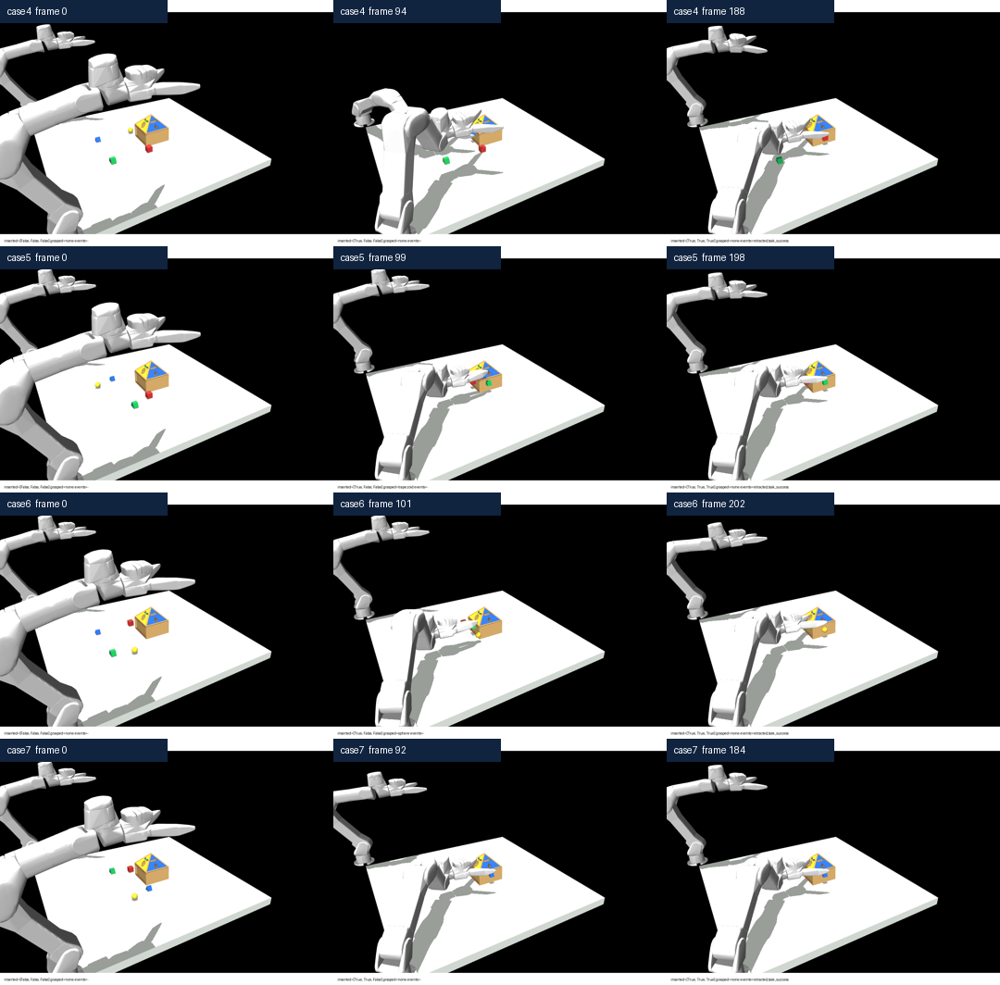
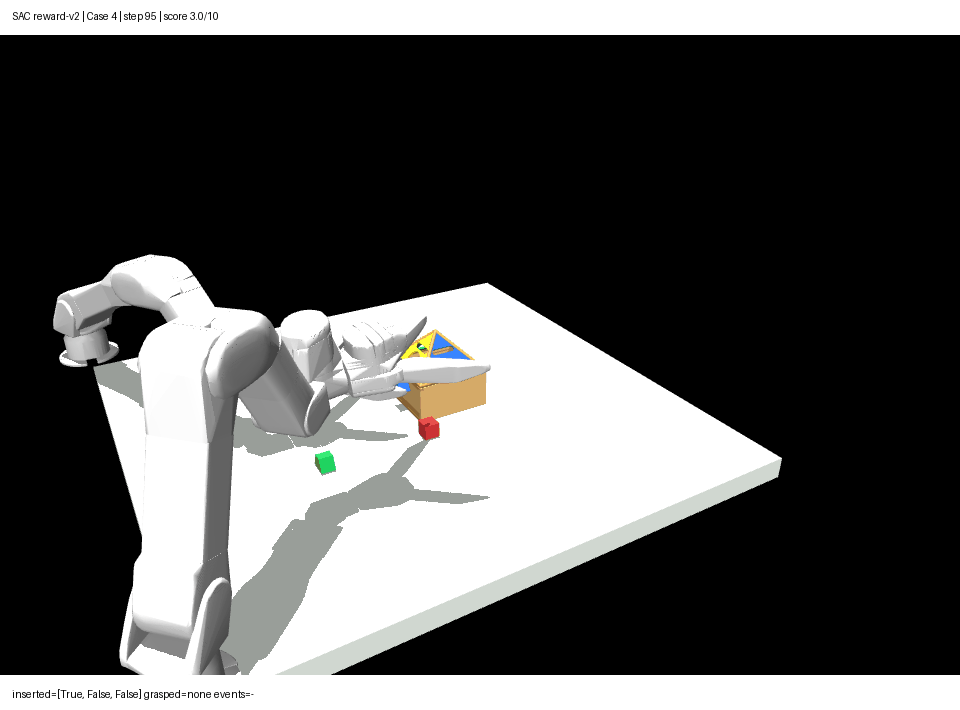
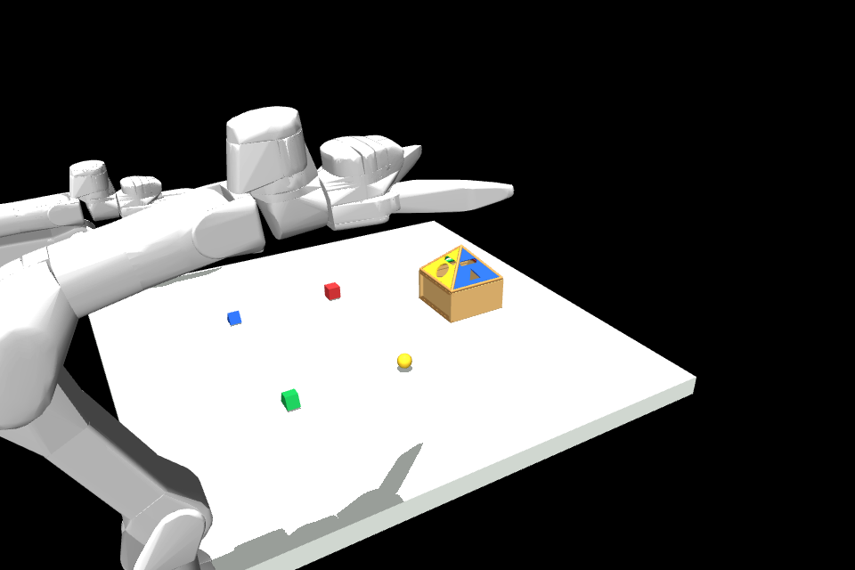
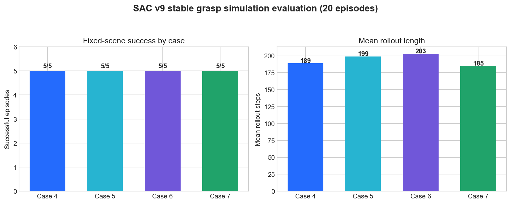
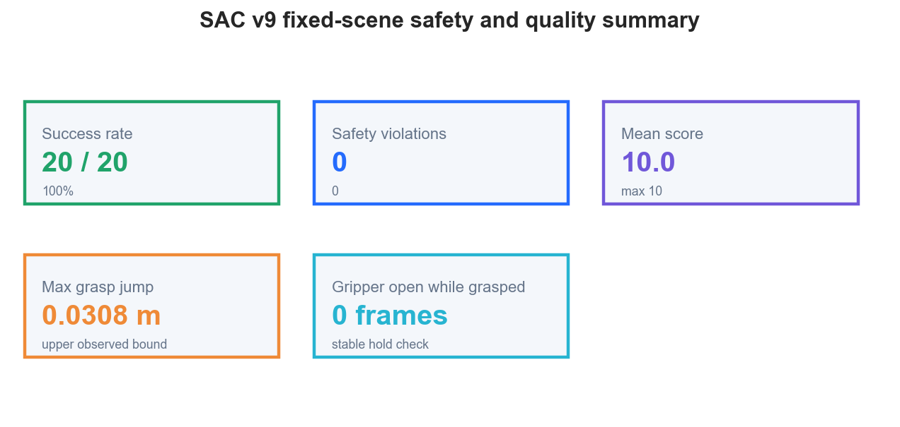

# Variable Reinforcement Learning

星野跃迁双臂机器人 Case 4–7 强化学习仿真 Demo。仓库包含独立的任务环境、SAC 训练与评估代码、稳定抓取模型 checkpoint、Case 4–7 仿真回放视频、数据摘要和安全边界说明。

> **重要口径**：仓库中的成功率和截图来自 headless MuJoCo/代理仿真回归，不是真实机械臂自主成功率。仿真环境用于验证任务逻辑、奖励、动作接口、策略回放和安全门；真机部署仍需独立完成标定、低速、限力、碰撞和急停验证。

## 仿真 Demo 截图

### Case 4–7 策略回放

下图从 v9 stable grasp 策略的 GIF 回放中抽取了初始、执行中和结束帧：



Case 4 的中段仿真画面：



初始场景示意：



### 可直接查看的动画

| Case | 仿真 GIF | MP4 |
|---|---|---|
| Case 4 | [case4.gif](demo/videos/case4.gif) | [case4.mp4](demo/videos/case4.mp4) |
| Case 5 | [case5.gif](demo/videos/case5.gif) | [case5.mp4](demo/videos/case5.mp4) |
| Case 6 | [case6.gif](demo/videos/case6.gif) | [case6.mp4](demo/videos/case6.mp4) |
| Case 7 | [case7.gif](demo/videos/case7.gif) | [case7.mp4](demo/videos/case7.mp4) |

## 数据截图

### 每个 Case 的成功次数和轨迹步数



### 安全和轨迹质量摘要



数据来自：[`demo/evaluation/stable_evaluation_20.json`](demo/evaluation/stable_evaluation_20.json)。本批次统计为：

| 指标 | 结果 |
|---|---:|
| 固定场景评估 | 20 episodes |
| 成功 | 20 / 20 |
| 平均得分 | 10.0 / 10 |
| 安全违规 | 0 |
| 最大抓取跳变 | 0.0308 m |
| 抓取中夹爪意外打开 | 0 frames |

每个 Case 的回放步骤为：Case 4 **189** 步、Case 5 **199** 步、Case 6 **203** 步、Case 7 **185** 步。具体成功定义是：三个目标块全部插入，并在任务结束后完成安全回撤。

## 项目结构

```text
src/
  tree_reinforcement_learning/   环境、任务、奖励、MuJoCo backend、安全和验收
  scripts/                       训练、评估、渲染和任务校验脚本
  config/                        Case 4–7 训练配置
  tests/                         单元测试和安全契约测试
  real_robot_sac_bridge/         真机只读采集、影子推理和标定门代码

demo/
  checkpoints/                   v9 stable grasp SAC checkpoint
  videos/                       Case 4–7 GIF/MP4 仿真回放
  evaluation/                   成功率、轨迹和模型对比 JSON

assets/
  simulation/                   仿真截图和回放 contact sheet
  data/                         README 使用的数据图表
```

## 快速开始

### 安装

```bash
python3 -m pip install -e 'src/.[rl,mujoco,test]'
```

### 任务和接口校验

```bash
PYTHONPATH=src python src/scripts/validate_tasks.py
PYTHONPATH=src python src/scripts/train.py --dry-run
PYTHONPATH=src python -m pytest src/tests
```

### ToyBackend smoke test

```bash
PYTHONPATH=src python src/scripts/train.py --backend toy --steps 10000
```

ToyBackend 只验证 Gym/SAC 接口，不代表物理仿真性能。

### MuJoCo 仿真训练

```bash
PYTHONPATH=src python src/scripts/validate_mujoco_backend.py
PYTHONPATH=src python src/scripts/train.py \
  --backend mujoco \
  --device cuda \
  --steps 300000
```

MuJoCo backend 默认读取项目配置中的场景路径；如果场景文件位于其他位置，请使用配置或 adapter 参数覆盖。训练输出和新 checkpoint 不提交到仓库，建议放在本地 `outputs/` 目录。

### 使用仓库中的 v9 checkpoint 做离线评估

```bash
PYTHONPATH=src python src/scripts/render_candidate_rollout.py
```

仓库中的 checkpoint：

```text
demo/checkpoints/sac_case4_7_best.zip
```

它对应 Case 4–7 stable grasp v9 仿真策略。加载 checkpoint 后请先运行固定场景回归，再考虑任何随机化或真机影子推理。

## 方法摘要

1. 任务层为 Case 4–7 编译目标物体、目标孔和禁止投入物体；
2. 策略动作使用 7 维归一化末端增量：`dx, dy, dz, droll, dpitch, dyaw, gripper`；
3. 奖励同时考虑抓取、插入、回撤、箱体位移、禁止接触、过大动作和超时；
4. 训练后通过固定场景、随机压力和安全违规三重门禁；
5. 失败候选保留用于分析，不覆盖稳定基线；
6. 真机侧只读采集和影子推理与训练环境分离，避免仿真成功直接被误写成真机成功。

## 证据和限制

- [`stable_evaluation_20.json`](demo/evaluation/stable_evaluation_20.json) 是 20 次固定场景仿真评估；
- [`evaluation_7models.json`](demo/evaluation/evaluation_7models.json) 保留了历史多模型对比和已知限制；
- 该仿真采用代理运动学/受限 MuJoCo backend，不能替代真实接触动力学验收；
- 仿真成功率不等同于 Case 1–10 的阶段性汇总成功率；
- 仓库不包含原始真机视频、机器人账号、SSH 密钥和大规模数据集；
- 真机运行前必须增加关节限位、速度/加速度限制、末端工作空间、力矩阈值、碰撞检测、通信 watchdog 和急停。

## 相关文档

- [`src/README.md`](src/README.md)：独立强化学习工程说明；
- [`src/docs/training_plan_zh.md`](src/docs/training_plan_zh.md)：训练计划；
- [`src/docs/residual_gate_v15_zh.md`](src/docs/residual_gate_v15_zh.md)：安全门和残差验证；
- [`src/real_robot_sac_bridge/README.md`](src/real_robot_sac_bridge/README.md)：真机只读采集和部署边界。

## 许可与发布说明

本仓库是项目阶段性代码和仿真证据归档。模型、数据和真机部署权限应按项目内部授权管理；未经安全评审，不得直接将仿真策略连接到机器人控制器。
